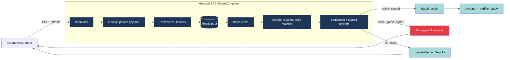

# Hecate: Confidential Intent Execution for Autonomous Agents

*A TEE-mediated private batch-crossing engine for ETH/USDC — research/MVP, running on EigenCompute mainnet-alpha with on-chain settlement contracts deployed on Sepolia.*

---

## TL;DR

Hecate is an API-first private batch-crossing engine for autonomous-agent
intents. Agents submit an intent as a public envelope plus an encrypted
private payload; an engine running inside an attested Trusted Execution
Environment decrypts the payload, runs deterministic uniform-clearing-price
matching, and emits signed public batch receipts together with signed
per-agent fill receipts. Anyone can replay a bundle and verify it; tampering
with any field invalidates verification.

The narrow technical thesis: a TEE-mediated matcher mitigates **pre-match
inspection** of richer-than-swap execution constraints (limit, partial-fill,
min fill, deadlines, fallbacks, max impact) by operators, solvers, and
unmatched counterparties — while preserving deterministic matching,
solvency-preserving settlement, and third-party receipt verification. We
describe this as **trust-reduced confidential execution**, not a private
exchange.

Status as of 2026-05: the engine is live on EigenCompute mainnet-alpha, three
contracts (settlement verifier, mock-USDC, prefunded vault) are deployed and
verified on Sepolia, and the v1 receipt-replay flow runs end-to-end against
the on-chain vault.

---

## The problem

Autonomous on-chain agents express execution under richer constraints than a
human placing a swap order: limit price, partial-fill rules, minimum fill,
batch deadlines, fallback behavior, max price impact, inventory-driven
sizing. To delegate execution, an agent must transmit enough constraint to
make matching decidable. As soon as a third party — a solver, a filler, an
operator — sees those constraints, they hold a fingerprint of the agent's
execution policy. Repeated observation lets a counterparty learn the agent's
model.

Existing intent and solver architectures have made different tradeoffs:

- **CoW Protocol, UniswapX** — strong execution quality via solver/filler
  competition, but solvers and fillers must see orders to bid, so rich
  agent constraints leak pre-match to the entire competitive pool.
- **Shutter (threshold encryption)** — protects ordering-time visibility,
  but the moment a block is opened, per-intent matching logic runs in
  public state.
- **Renegade (MPC + ZK dark pool)** — strong cryptographic confidentiality
  for swap-shaped orders, at the cost of expressiveness and complexity for
  programmable agent constraints.

Hecate sits between Shutter and Renegade: a TEE-mediated expressive intent
matcher with weaker trust assumptions than ZK and stronger expressiveness
than threshold encryption. The tradeoff is explicit — we exchange
cryptographic strength for expressiveness, latency, and engineering
practicality.

---

## How it works



Concretely:

1. The agent builds an intent: a **public envelope** (intent id, agent id,
   market, expiry, payload commitment, payload ciphertext, nonce, signature)
   and an **encrypted private payload** (side, asset legs, max amount,
   limit price, partial-fill rules, min fill, deadlines, max price impact,
   fallback). Note what the envelope does *not* reveal: even the side
   (buy vs sell) is inside the encrypted payload, so an operator inspecting
   submitted envelopes cannot tell which direction the agent intends to
   trade. The payload commitment binds the envelope to a specific
   ciphertext, so the matcher can reject any ciphertext that doesn't hash
   back to what the envelope was signed over.
2. `POST /intents` hits the engine. Under a global mutex, the engine
   verifies the envelope signature, decrypts the payload inside the TEE,
   checks that the payload hashes to the envelope's commitment, and
   reserves vault funds for the intent. On success the intent enters an
   in-memory ready pool; on rejection the engine writes an append-only
   rejection log and does not mutate vault state.
3. `POST /batches/close` collects the ready pool, runs a pure
   uniform-clearing-price matcher, applies settlement against the vault,
   and emits one signed batch receipt plus one signed fill receipt per
   filled intent.
4. Anyone holding the resulting bundle can call the verifier to recompute
   the batch receipt body, recover the engine signer, and check that every
   structural field matches. Tampering with any field — clearing price,
   payload commitment, settlement hash, runtime metadata — causes
   verification to fail.
5. Per-intent private artifacts (fill receipts, intent status) are
   accessible only to the owning agent, via a signed challenge whose action
   field and intent id are bound into the signature so a challenge for
   `intent_a` cannot fetch `intent_b` and a `GET_INTENT_STATUS` signature
   cannot be replayed at `GET_FILL_RECEIPT`.

---

## Module layout

```
┌────────────────────────┐         ┌──────────────────────────┐
│ Agent simulator (CLI)  │ ─HTTP─► │ Intent API (Fastify)     │
│ agents/                │         │ server/                  │
└────────────────────────┘         └──────────────┬───────────┘
                                                  │
                ┌─────────────────────────────────┼──────────────────────────────────┐
                ▼                                 ▼                                  ▼
   ┌────────────────────┐          ┌──────────────────────────┐         ┌────────────────────────┐
   │ Solvency layer     │          │ Matching engine          │         │ Receipt + verify       │
   │ shared/vault/      │          │ shared/matching/         │         │ shared/receipts/       │
   │ - mockVault        │          │ - acceptIntent           │         │ - buildBatchReceipt    │
   │ - reservations     │          │ - buildBatchFromReady…   │         │ - buildFillReceipts    │
   │ - invariants       │          │ - clearUniform           │         │ shared/verify/         │
   └────────────────────┘          └──────────────────────────┘         │ - verifyFullBatch      │
                                                  │                     └────────────────────────┘
                                                  ▼
                                    ┌──────────────────────────┐
                                    │ Settlement               │
                                    │ shared/settlement/       │
                                    │ - buildSettlementObject  │
                                    │ - applySettlement        │
                                    └──────────────────────────┘
```

`shared/*` modules are pure: no file I/O, no `Date.now()` in pure logic
(passed in as `now_ms`), no globals. The Fastify server owns persistence and
the global FIFO mutex. The agent simulator is the only client that exercises
the demo path end-to-end. See [`docs/ARCHITECTURE.md`](docs/ARCHITECTURE.md)
for the full layering and dependency graph.

---

## Why Eigen specifically

Hecate's trust model is shaped around what an attested TEE buys you:

- **Image digest stamped into every receipt.** Every receipt body carries
  `engine_code_digest` plus, under `EIGEN_TEE`, `eigencompute_app_id`,
  `eigencompute_image_digest`, and `eigencompute_attestation_id`. A
  verifier can therefore check that a receipt is attributable to a
  specific binary and a specific Eigen deployment, and reject anything
  that doesn't match the digest it expects.
- **Strict `EIGEN_TEE` startup, no silent fallback.** When
  `RUNTIME_MODE=EIGEN_TEE`, the server refuses to start unless
  `EIGENCOMPUTE_APP_ID`, `EIGENCOMPUTE_IMAGE_DIGEST`, and
  `EIGENCOMPUTE_ATTESTATION_ID` are all set. Receipts always state the
  runtime mode they were produced under, so a receipt produced under
  `LOCAL_MOCK` cannot impersonate one produced under `EIGEN_TEE`.
- **Live deployment.** The engine is running on EigenCompute mainnet-alpha
  as app `0x362a966eB23597190483634d6769Fc41b87514B3` at endpoint
  `35.204.215.188:8787`, image `sha256:5aed3323…`. The currently deployed
  image runs pre-V2 code; on-chain vault integration goes live with the
  next redeploy (see "What's deployed" below).
- **Future Eigen app-wallet signing.** In v1, the engine signs receipts
  with a local development key (`signer.mode = "LOCAL_DEV_KEY"` in
  `/attestation`). Real Eigen app-wallet signing — where the signer
  identity is itself an Eigen-managed key bound to the attestation — is
  the next milestone. See
  [`docs/EIGEN_DEPLOYMENT.md`](docs/EIGEN_DEPLOYMENT.md) §8.

---

## What's verifiable today

- **728** vitest cases across **60** files; **30**-cycle deterministic
  soak (`npm run test:soak`); **9** adversarial test files covering
  matching, settlement, vault, receipts, access control, persistence
  corruption, decimal boundaries, full-flow API abuse, and a
  property-based fuzz that mutates random leaves of a saved bundle.
- **14** tamper scenarios in the verifier replay CLI. The strongest
  single-screen demo is `--scenario wrong-key`: the attacker rebuilds the
  batch receipt body unchanged, signs it with a different key, and every
  structural field still matches — but `ENGINE_SIGNER_MISMATCH` fires on
  the authority check. `bash scripts/demo-replay.sh` runs the honest path
  followed by every tamper scenario in sequence.
- **44** Forge tests across three Sepolia-deployed contracts plus one
  cross-tool ABI parity pin keeping solc's `abi.encode` aligned with
  viem's `encodeAbiParameters` for vault settlement.

## What's deployed

| Artifact | Status |
|---|---|
| Engine (EIGEN_TEE) | Live on EigenCompute mainnet-alpha — app `0x362a966eB23597190483634d6769Fc41b87514B3`, endpoint `35.204.215.188:8787`, image `sha256:5aed3323…` (currently runs pre-V2 code; on-chain vault integration goes live with the next redeploy) |
| `HecateSettlementVerifier.sol` | Sepolia `0x0bAcD73a36f774Cb7c2f252a2d3c002A0079D4E2` — verified on Etherscan |
| `HecateVault.sol` | Sepolia `0x7EF8583489eEb158bf9233bC7a38e0EC410eF1aA` — verified; engine reads balances when `VAULT_BACKEND=onchain` |
| `MockUSDC.sol` | Sepolia `0x1662B5050B70c8fAc9405d11B3e7eCDe9eF6c3cB` — verified; 6-decimal demo ERC-20 with public mint |

Full manifest: [`deployments/sepolia.json`](deployments/sepolia.json).

---

## Honest limitations

Hecate is a research/MVP, and every claim above is bounded by the following:

- **`LOCAL_MOCK` encryption is architectural, not security.** AES-GCM with
  a `CODE_DIGEST`-derived key. Anyone with process-level access to a
  `LOCAL_MOCK` server can read decrypted payloads. The encryption boundary
  is meaningful only inside a real TEE.
- **No live Eigen attestation chain verification yet.** `EIGEN_TEE`
  enforces metadata coherence (image digest, app id, attestation id) at
  startup but does not yet walk the Eigen attestation chain. This is on
  the [roadmap](docs/ROADMAP.md).
- **Engine signs with a local development key.** `/attestation` reports
  `signer.mode = "LOCAL_DEV_KEY"`. The receipt signer is bound to the
  image digest by deployment discipline, not yet by Eigen app-wallet
  binding.
- **v1 vault is a mock prefunded ledger.** `HecateVault.sol` is deployed
  on Sepolia but not yet engine-integrated for write-side custody. v1
  receipts do not move real funds; receipts produced under `LOCAL_MOCK`
  are research artifacts.
- **In-memory ready pool.** If the server restarts after `acceptIntent`
  succeeded but before the next batch close, the decrypted payload is
  lost. Reservations remain on disk; the intent is recoverable as
  unmatched.
- **Public outputs leak some private constraints by construction.** The
  clearing price is public; a binding limit price may be inferable. The
  envelope reveals `agent_id`. A counterparty learns from their own fill.
  Pairwise inference over repeated matches is unavoidable for any matcher
  that publishes settlement.
- **Single market, single process.** ETH/USDC only. One Fastify process,
  one global FIFO mutex. Multi-process / multi-host coordination is out
  of scope for v1.

Hecate does not provide ZK-grade privacy, does not hide strategy over time,
does not address hardware side-channel attacks, and does not solve MEV.

---

## Further reading

- [`docs/TECHNICAL_PAPER.md`](docs/TECHNICAL_PAPER.md) — design intent, claims, limitations
- [`docs/THREAT_MODEL.md`](docs/THREAT_MODEL.md) — what the TEE helps with and does not
- [`docs/ARCHITECTURE.md`](docs/ARCHITECTURE.md) — components, layering, data flow
- [`docs/EIGEN_DEPLOYMENT.md`](docs/EIGEN_DEPLOYMENT.md) — Docker prep + Eigen integration plan
- [`docs/DEMO.md`](docs/DEMO.md) — exact commands and expected output
- [`docs/SOLVENCY_AND_VAULTS.md`](docs/SOLVENCY_AND_VAULTS.md) — why solvency is separate from TEE correctness
- [`docs/COMPARISONS.md`](docs/COMPARISONS.md) — vs CoW, UniswapX, Angstrom, Shutter, Renegade
- [`docs/ROADMAP.md`](docs/ROADMAP.md) — future work
